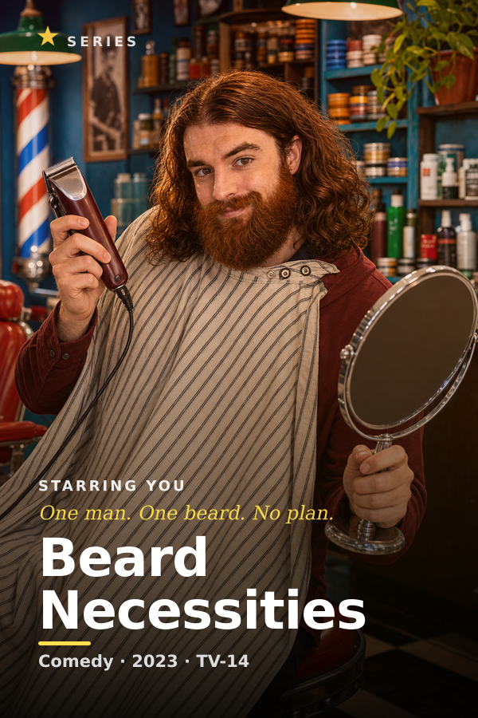
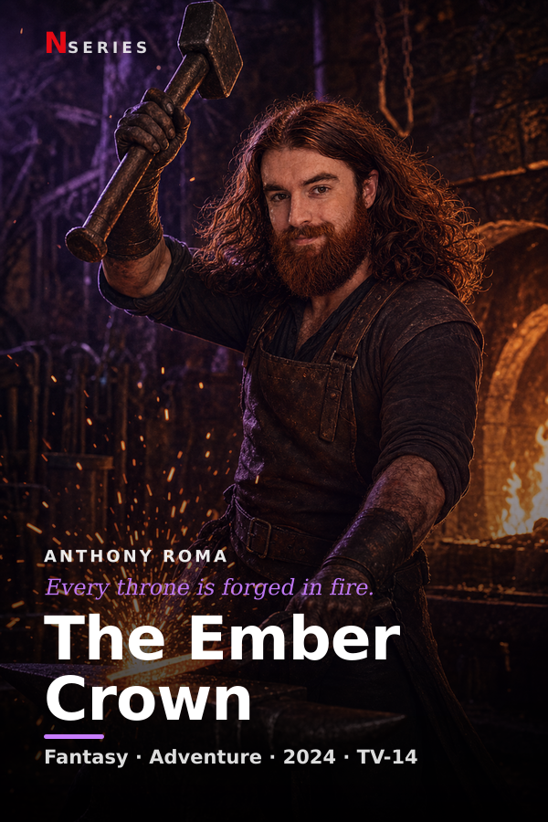
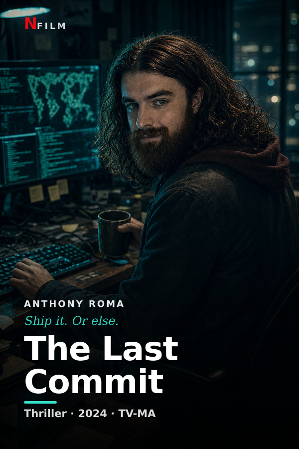

# 🍿 Netflix Clone

A polished, full-featured Netflix UI clone built with **Next.js 16 (App Router)**, **React 19**, **TypeScript**, and **Tailwind CSS v4** — featuring a **personalized "Starring You" catalog** whose movie posters are generated programmatically from a real photo.

> ### ▶️ **[Live demo → anthonynetclone.netlify.app](https://anthonynetclone.netlify.app/)**
>
> Try it: pick a profile, search the catalog, add titles to **My List**, hit **Play** to start **Continue Watching**, and open a series to see **Episodes** + **More Like This**.


---

## ✨ What makes this different

Most Netflix clones are a static UI over the TMDB API. This one adds a twist: a row of **10 original titles that star _you_**. Each poster + wide backdrop is **generated at build time** from a single headshot using an image-processing pipeline (`sharp`) — color-graded per genre, framed with title typography, a tagline, a star credit, and a scrim, then composited onto themed artwork.

It also ships a **second pipeline** that frames AI-generated scene images (one per title) into finished posters, so you can drop in "you as a Viking / sci-fi hero / noir detective" and the app reframes them automatically.

<table>
  <tr>
    <td></td>
    <td></td>
    <td></td>
    <td></td>
    <td></td>
  </tr>
</table>

> _Replace the photo in `public/` and re-run the generator to make the catalog star anyone._

---

## 🎬 Features

**Browse**
- Billboard **hero** with Play / More Info
- Horizontally scrollable **content rows** with hover arrows and **arrow-key** navigation
- **Hover cards** that expand to reveal quick actions (▶ Play, ➕ My List, 👍) and metadata
- **Top 10 Today** row with the signature oversized rank numerals
- Poster **shimmer placeholders** while images load

**Search & My List**
- Live **search** filtering the whole catalog by title or genre
- **My List** add/remove from any card or the modal, **persisted to `localStorage`**

**Profiles & Continue Watching**
- **"Who's watching?"** profile gate; switch profiles from the navbar
- My List and Continue Watching are **per-profile**
- **Continue Watching** row with real **progress bars** — the player tracks your position and **resumes** where you left off

**Detail modal**
- In-modal **trailer player** with **mute/unmute** (YouTube embed in TMDB mode, sample clip in demo mode)
- **Episodes** list with a season selector for series
- **More Like This** grid (genre-matched) — click to dive into a related title
- **Focus-trapped** and keyboard accessible (Esc to close)

**Production polish**
- Scroll-aware **navbar** + **mobile hamburger** menu
- **SEO / Open Graph** metadata and a styled **404** page
- Optional **TMDB** integration for real posters, backdrops & trailers

---

## 🛠️ Tech stack

| | |
|---|---|
| **Framework** | Next.js 16 (App Router, Server Components) |
| **UI** | React 19, Tailwind CSS v4 |
| **Language** | TypeScript |
| **Image pipeline** | `sharp` (SVG → PNG compositing, color grading, masks) |
| **State** | React Context + `localStorage` (My List, profiles, Continue Watching) |
| **Data** | Bundled mock catalog, optional TMDB REST API |

---

## 🚀 Getting started

```bash
npm install
npm run dev
```

Open [http://localhost:3000](http://localhost:3000). Works fully offline with the bundled catalog — no API keys required.

```bash
npm run build && npm start   # production build
npm run lint                 # eslint
```

---

## 🖼️ The "Starring You" pipeline

Two Node scripts generate all of the original artwork (posters + 16:9 backdrops) with `sharp`:

```bash
node scripts/generate-originals.mjs   # gradient/motif posters for fictional originals
node scripts/generate-starring.mjs    # composites YOUR photo into 10 genre posters
```

`generate-starring.mjs` either:
1. **stylizes a headshot** (`public/headshot-*.png`) with per-genre transforms — comic ink, cyan hologram, noir, glitch, pop-art, sepia, etc. — feathered onto themed backgrounds; **or**
2. **frames a drop-in image** from `public/starring/source/<slug>.png` (e.g. an AI-generated scene) into a finished poster.

Posters carry the title art (used on cards); the wide backdrops are kept text-free so the hero/modal can overlay their own UI — exactly how Netflix does it. See [`STARRING-PROMPTS.md`](STARRING-PROMPTS.md) for ready-to-paste AI prompts per title.

---

## 🎞️ Optional: real data from TMDB

Demo mode uses the bundled catalog. To pull live artwork and trailers:

1. Create a free account at [themoviedb.org](https://www.themoviedb.org/).
2. Grab an API key (v3 auth) from [Settings → API](https://www.themoviedb.org/settings/api).
3. Copy `.env.local.example` to `.env.local` and set `TMDB_API_KEY=your_key`.
4. Restart the dev server. The app fetches real rows and **falls back to mock data** on any error.

---

## 📁 Project structure

```
src/
  app/
    layout.tsx          Root layout + SEO/OG metadata
    page.tsx            Home (Server Component) — fetches data, composes providers
    loading.tsx         Branded route-loading screen
    not-found.tsx       Styled 404
    globals.css         Tailwind theme + animations + shimmer
  components/
    ProfileProvider     "Who's watching?" gate + per-profile context
    CatalogProvider     Search + My List + Continue Watching (localStorage)
    ModalProvider       App-wide detail modal
    Navbar · Hero · Row · Top10Row · Card · Footer
    HomeContent         Browse-vs-search shell
    ContinueRow · MyListRow · SearchResults
    TitleModal · EpisodesSection · MoreLikeThis
  lib/
    types · mockData · originalsData · starringData
    content.ts          getHomeData() — TMDB with mock fallback (server-only)
    tmdb.ts             Optional TMDB integration
    images.ts           Image URLs + deterministic gradient posters
    episodes.ts         Mock episode generation for series
scripts/
  generate-originals.mjs · generate-starring.mjs
```

---

## 📝 Notes

- Personal/portfolio project — **not affiliated with Netflix, Inc.** All title names are fictional.
- Trailer playback in demo mode uses a public-domain sample clip.
